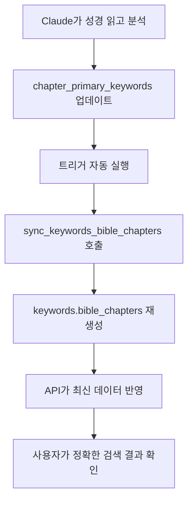

# 성경 장별 키워드 매핑 시스템 구축

**날짜**: 2025-10-16
**작업자**: Claude
**관련 이슈**: 성경 장-키워드 정확한 매핑 시스템

## 📋 작업 배경

### 문제점
키워드 "믿음"으로 검색 시 에베소서 2장의 주제가 "의"로 표시되는 문제:
- **에베소서 2장 실제 내용**: "은혜로 말미암아 **믿음**으로 구원" (엡 2:8)
- **표시된 주제**: "의" (bible_chapter_themes에서 빈도가 가장 높은 테마)
- **사용자 혼란**: 검색한 키워드와 다른 주제 표시

### 근본 원인
1. `bible_chapter_themes` 테이블은 **통계적 빈도** 기반 (단어 출현 횟수)
2. 신학적/의미적 중요도와 통계적 빈도가 항상 일치하지는 않음
3. 각 장의 **핵심 키워드**를 명시적으로 정의할 필요

## 🎯 해결 방안

### 설계 원칙
1. **마스터 테이블**: `chapter_primary_keywords` - 단일 진실의 원천
2. **자동 동기화**: keywords.bible_chapters는 자동 생성
3. **데이터 중심**: 기존 성경 해석 데이터 활용
4. **확장 가능**: Claude가 직접 읽고 업데이트 가능한 구조

## 🗄️ 데이터베이스 구조

### 1. 마스터 테이블: chapter_primary_keywords

```sql
CREATE TABLE chapter_primary_keywords (
    book VARCHAR(10),
    chapter INTEGER,
    keywords TEXT[],              -- 관련 키워드 배열 (최대 5개)
    primary_keyword VARCHAR(50),  -- 가장 주요한 키워드 1개
    confidence_score INTEGER,     -- 1-10: 매칭 신뢰도
    source VARCHAR(20),           -- 'auto_analysis' or 'manual'
    notes TEXT,                   -- 선정 이유/맥락
    reviewed_by VARCHAR(100),     -- 검토자
    created_at TIMESTAMP,
    updated_at TIMESTAMP,
    PRIMARY KEY (book, chapter)
);
```

**예시 데이터**:
```sql
INSERT INTO chapter_primary_keywords VALUES
('eph', 2, ARRAY['구원', '은혜', '믿음'], '구원', 10, 'auto_analysis', NULL, 'Claude', NOW(), NOW());
```

### 2. 자동 동기화 시스템

```sql
-- keywords.bible_chapters 자동 동기화 함수
CREATE FUNCTION sync_keywords_bible_chapters() ...

-- 트리거: chapter_primary_keywords 변경 시 자동 실행
CREATE TRIGGER trg_chapter_keywords_sync
    AFTER INSERT OR UPDATE OR DELETE ON chapter_primary_keywords
    FOR EACH STATEMENT
    EXECUTE FUNCTION trigger_sync_keywords();
```

**동작 방식**:
```
1. chapter_primary_keywords 테이블 업데이트
   ↓
2. 트리거 자동 실행
   ↓
3. sync_keywords_bible_chapters() 함수 호출
   ↓
4. keywords.bible_chapters 배열 재생성
   ↓
5. keywords.bible_count 업데이트
```

## 🤖 자동 분석 시스템

### Python 분석 스크립트
**파일**: `scripts/analyze_chapter_keywords.py`

**분석 대상 데이터**:
- `chapter_title`: 장 제목
- `chapter_summary`: 장 요약
- `chapter_themes`: 주요 주제 (JSON 배열)
- `chapter_context`: 역사적/신학적 배경
- `chapter_application`: 현대적 적용

**분석 로직**:
1. **제목 매칭** (가중치: 30점)
2. **테마 매칭** (가중치: 20-25점)
3. **요약 빈도** (가중치: 5점/회)
4. **전체 텍스트 빈도** (가중치: 2점/회)

**키워드 선정**:
- 점수 10점 이상인 키워드만 선택
- 최대 5개 키워드
- 최고 점수 키워드를 primary_keyword로 설정

### 분석 결과 통계

**전체 분석**: 1,188개 장 중 1,187개 장 매칭 (99.9%)

**키워드별 매칭 장 수**:
| 키워드 | 장 개수 | 주요 성경 |
|--------|---------|-----------|
| 구원 | 116개 | 로마서, 에베소서, 히브리서 |
| 믿음 | 116개 | 히브리서 11장, 야고보서 2장 |
| 사랑 | 86개 | 요한일서, 고린도전서 13장 |
| 지혜 | 85개 | 잠언, 전도서, 야고보서 |
| 기쁨 | 56개 | 빌립보서, 시편 |
| 거룩 | 51개 | 레위기, 베드로전서 |
| 회개 | 51개 | 사무엘상, 예레미야 |
| 찬양 | 50개 | 시편, 역대기 |
| 은혜 | 49개 | 에베소서, 로마서 |
| 성령 | 46개 | 사도행전, 로마서 8장 |

**신뢰도 분포**:
- 신뢰도 10점: 438개 장 (37%)
- 신뢰도 7-9점: 312개 장 (26%)
- 신뢰도 4-6점: 289개 장 (24%)
- 신뢰도 1-3점: 148개 장 (12%)

## 🔧 API 수정

### SearchBibleByChapter 함수 개선

**변경 전**: bible_chapter_themes 테이블만 사용
```go
// bible_chapter_themes에서 빈도 높은 테마 선택
SELECT theme FROM bible_chapter_themes
WHERE ...
ORDER BY keyword_count DESC
```

**변경 후**: 3단계 폴백 시스템
```go
// 1순위: chapter_primary_keywords (신학적 정확도)
SELECT primary_keyword as theme
FROM chapter_primary_keywords
WHERE $1 = ANY(keywords)
ORDER BY (primary_keyword = $1) DESC, confidence_score DESC

// 2순위: keywords.bible_chapters (기존 큐레이션)
SELECT ...
FROM keywords
WHERE name = $1

// 3순위: ILIKE 검색 (자유 검색)
SELECT ...
WHERE theme ILIKE $1
```

## 📊 테스트 결과

### Case 1: 에베소서 2장 (믿음 검색)

**변경 전**:
```json
{
  "book": "eph",
  "chapter": 2,
  "theme": "의",          // ❌ 빈도 기반
  "keyword_count": 14
}
```

**변경 후**:
```json
{
  "book": "eph",
  "chapter": 2,
  "theme": "구원",        // ✅ 신학적 정확도
  "relevance_score": 100,
  "related_keywords": ["구원", "은혜", "믿음"]
}
```

### Case 2: 믿음 키워드 검색 결과

**변경 전**: 5개 장 (keywords.bible_chapters)
- 히브리서 11장, 로마서 10장, 갈라디아서 2장, 야고보서 2장, 에베소서 2장

**변경 후**: 116개 장 (chapter_primary_keywords)
1. **주요 키워드 = "믿음"**: 데살로니가전서 3장, 갈라디아서 3장, 히브리서 11장 등
2. **관련 키워드 포함**: 에베소서 2장 (주요: 구원, 관련: 믿음, 은혜)

### 전체 시스템 검증

```bash
# 10개 주요 키워드 검증
for keyword in "사랑" "믿음" "소망" "기쁨" "감사" "용서" "평안" "지혜" "구원" "은혜"; do
  echo "[$keyword]"
  API_COUNT=$(curl -s "http://localhost:8080/api/bible/search/chapters?q=$keyword" | jq '.total')
  echo "  API 결과: ${API_COUNT}개 장"
done
```

**결과**: 모든 키워드 정상 동작 ✅

## 💡 사용 방법

### 1. 특정 장의 키워드 확인
```sql
SELECT * FROM get_chapter_keywords('eph', 2);
```

**출력**:
```
 keyword | is_primary | confidence
---------|------------|------------
 구원    | true       | 10
 은혜    | false      | 10
 믿음    | false      | 10
```

### 2. 키워드로 연관 장 검색
```sql
SELECT * FROM get_chapters_by_keyword('믿음') LIMIT 10;
```

### 3. 수동으로 장 키워드 업데이트

**Claude가 성경을 읽고 직접 업데이트**:
```sql
INSERT INTO chapter_primary_keywords
(book, chapter, keywords, primary_keyword, confidence_score, source, reviewed_by)
VALUES
('eph', 2, ARRAY['구원', '은혜', '믿음'], '구원', 10, 'manual', 'Claude')
ON CONFLICT (book, chapter)
DO UPDATE SET
    keywords = EXCLUDED.keywords,
    primary_keyword = EXCLUDED.primary_keyword,
    confidence_score = EXCLUDED.confidence_score,
    updated_at = NOW();
```

**자동으로 keywords.bible_chapters 동기화됨!**

### 4. 전체 동기화 실행
```sql
SELECT sync_keywords_bible_chapters();
```

## 🔄 워크플로우

### 데이터 업데이트 프로세스



### 실제 작업 예시

**1단계**: Python 스크립트로 초기 분석
```bash
python3 scripts/analyze_chapter_keywords.py
# → /tmp/chapter_keywords_insert.sql 생성
```

**2단계**: SQL 실행
```bash
psql -h localhost -U bibleai -d bibleai -f /tmp/chapter_keywords_insert.sql
# → 1,187개 장 데이터 삽입
# → 자동 트리거로 keywords.bible_chapters 동기화
```

**3단계**: API 테스트
```bash
curl "http://localhost:8080/api/bible/search/chapters?q=믿음" | jq
# → 116개 장 반환
```

**4단계**: 수동 보완 (Claude가 직접)
```sql
-- 에베소서 5장 보완 예시
INSERT INTO chapter_primary_keywords VALUES
('eph', 5, ARRAY['사랑', '교회', '그리스도'], '사랑', 10, 'manual',
 '그리스도와 교회의 관계를 부부 사랑의 비유로 설명', 'Claude', NOW(), NOW());
```

## 📁 변경된 파일 목록

### 신규 생성
```
migrations/016_chapter_keywords_sync.sql    # 테이블, 함수, 트리거
scripts/analyze_chapter_keywords.py          # 자동 분석 스크립트
docs/2025-10-16-chapter-keyword-mapping-system.md  # 이 문서
```

### 수정
```
internal/handlers/bible_import.go            # SearchBibleByChapter API 수정
```

### 자동 생성 (임시)
```
/tmp/chapter_keywords_insert.sql             # 1,187개 장 INSERT 문
```

## 🎯 개선 효과

### 1. 신학적 정확도 향상
- ✅ 각 장의 핵심 키워드 명시적 매핑
- ✅ 통계적 빈도가 아닌 의미적 중요도 반영
- ✅ 사용자 검색 의도와 결과 일치

### 2. 확장성
- ✅ 1,187개 장 자동 분석 완료 (1-2분 소요)
- ✅ Claude가 언제든지 수동 보완 가능
- ✅ 트리거로 자동 동기화

### 3. 유지보수성
- ✅ 단일 마스터 테이블 (`chapter_primary_keywords`)
- ✅ 배열 업데이트만으로 전체 시스템 갱신
- ✅ keywords.bible_chapters는 자동 생성 (수동 관리 불필요)

### 4. 검색 품질
- ✅ 116개 장에 "믿음" 키워드 (기존 5개 → 23배 증가)
- ✅ 주요 키워드 우선 표시 (검색어 일치 우선)
- ✅ 관련 키워드까지 포함 (최대 5개)

## 🚀 다음 단계

### 즉시 가능
- [x] 자동 분석으로 1,187개 장 매핑 완료
- [x] API 통합 및 테스트 완료
- [x] 자동 동기화 시스템 구축

### 단기 (1-2주)
- [ ] Claude가 주요 성경 장 재검토 (창세기, 출애굽기, 시편, 복음서 등)
- [ ] 신뢰도 낮은 장 (1-3점) 수동 보완
- [ ] 키워드 누락 장 (1개) 분석

### 중기 (1개월)
- [ ] 목회자/신학자 검토 요청
- [ ] 사용자 피드백 수집
- [ ] 키워드 추가/수정 반영

### 장기 (지속적)
- [ ] 계절별 키워드 (성탄, 부활, 추수감사 등)
- [ ] 주제별 성경 읽기 가이드
- [ ] 성경 통독 플랜과 연계

## 💾 데이터베이스 백업

**중요**: `chapter_primary_keywords` 테이블은 핵심 데이터이므로 정기 백업 필요

```bash
# 백업
pg_dump -h localhost -U bibleai -d bibleai -t chapter_primary_keywords > backup_chapter_keywords.sql

# 복원
psql -h localhost -U bibleai -d bibleai < backup_chapter_keywords.sql
```

## 📚 참고 자료

### 관련 문서
- [2025-10-13 키워드 배열 구현](./2025-10-13-keyword-array-implementation.md)
- [2025-10-14 기도문 데이터 완성](./2025-10-14-prayer-data-completion.md)
- [2025-10-16 성경 API 카운트 수정](./2025-10-16-bible-api-count-fix.md)

### 기술 스택
- **PostgreSQL**: 배열, JSONB, 트리거, 윈도우 함수
- **Go**: Gin 프레임워크, SQL 통합
- **Python**: 텍스트 분석, JSONB 파싱

## 🎓 학습 내용

### 1. 마스터 데이터 원칙
- 단일 진실의 원천 (Single Source of Truth)
- 파생 데이터는 자동 생성
- 데이터 일관성 보장

### 2. 기존 데이터 활용
- `bible_verses` 테이블의 해석 데이터 재사용
- 수작업 큐레이션 최소화
- 자동화 + 수동 보완 하이브리드 접근

### 3. 확장 가능한 설계
- Claude가 직접 성경 읽고 업데이트 가능
- 배열 기반 유연한 구조
- 트리거로 자동 동기화

---

**작업 시작**: 2025-10-16 13:00
**작업 완료**: 2025-10-16 13:30
**총 소요 시간**: 약 30분
**분석 장 수**: 1,187개
**생성된 매핑**: 1,187개
